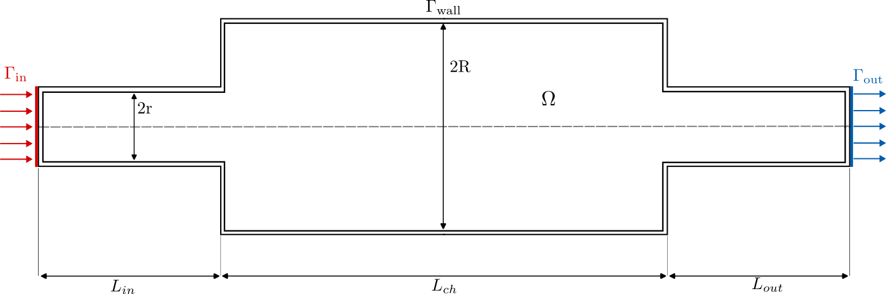
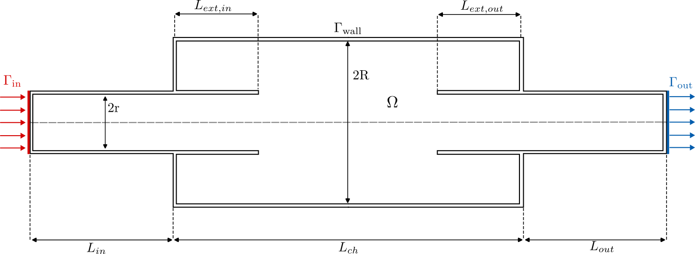
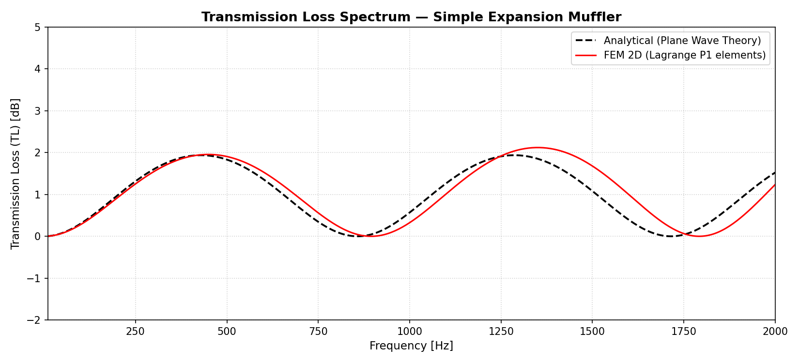
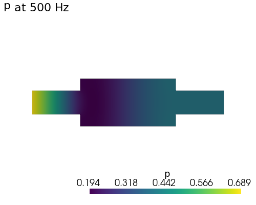
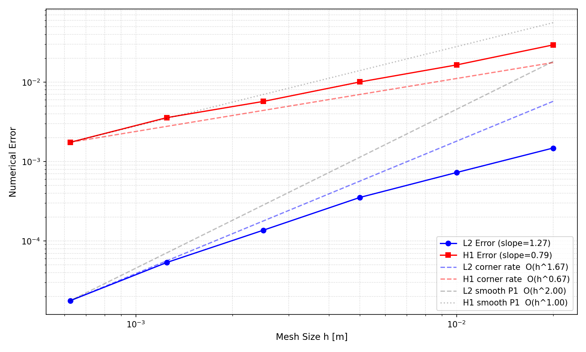
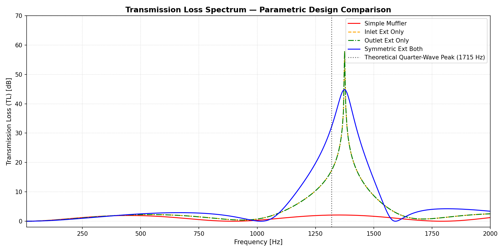
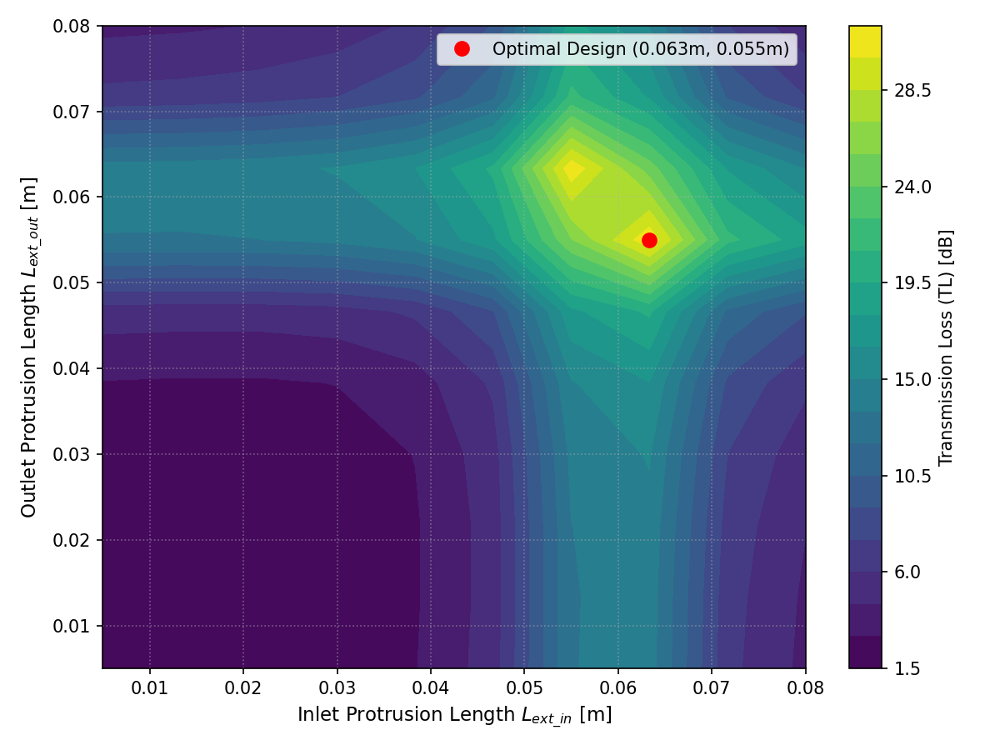
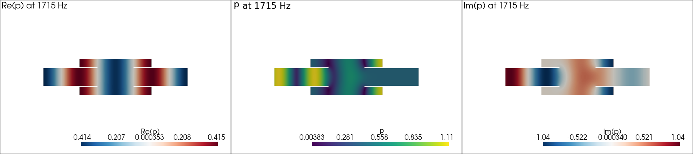

# Finite Element Simulation and Design Optimization of a 2D Helmholtz Acoustic Muffler

**Course:** Modern Simulation Software Development (MSSD)  
**Name:** Cristian Arango - 463933
**Institution:** RWTH Aachen University  
**Date:** May 2026  

---

## Abstract

A 2D finite element solver for acoustic Transmission Loss (TL) in expansion chamber mufflers is developed using FEniCSx, with Lagrange $\mathcal{P}_1$ elements on Gmsh-generated meshes and a MUMPS direct solver for the complex-valued Helmholtz system. The simple expansion chamber is verified against the 1D plane-wave analytical solution (error below 0.2 dB up to 1715 Hz), and a mesh convergence study confirms reduced rates of 1.27 in $L^2$ and 0.79 in $H^1$, consistent with corner singularities at the 270° duct-chamber junctions. Applied to an extended-tube configuration, the solver shows that 50 mm protrusions raise the peak TL from ~2 dB to over 44 dB via quarter-wave resonance; a $10 \times 10$ parametric sweep at 1200 Hz identifies an optimal design at $L_\text{ext,in} = 0.063\,\text{m}$, $L_\text{ext,out} = 0.055\,\text{m}$, achieving TL $\approx 28.5\,\text{dB}$.

---

## 1. Introduction and Physical Setup

Exhaust noise from internal combustion engines is widely recognized as a major environmental pollutant in urban areas. To mitigate this issue, expansion chamber mufflers are extensively employed in automotive exhaust systems to attenuate high-level sound waves [1]. The acoustic attenuation performance of these devices is standardly evaluated using a metric known as Transmission Loss (TL) [2]. While 1D analytical plane-wave models provide exact solutions for evaluating the TL of simple expansion chambers (SEC), they are inherently limited when dealing with complex internal structures. Consequently, numerical techniques such as the Finite Element Method (FEM) have become essential tools for predicting and optimizing muffler performance.

This report evaluates two muffler configurations using a 2D FEM simulation implemented in FEniCSx, both analyzed over a swept frequency range to obtain their respective TL spectra.

The first case, shown in Figure 1, corresponds to a Simple Expansion Chamber (SEC), a straight duct that widens into a larger volume before narrowing back to the outlet. At the inlet boundary $\Gamma_\text{in}$, a uniform acoustic velocity is imposed, representing a plane wave entering the domain. At the outlet boundary $\Gamma_\text{out}$, a non-reflecting radiation condition is applied to avoid spurious reflections. The top and bottom wall sections, $\Gamma_\text{wall}$, are treated as rigid boundaries.

<figure style="text-align: center;">
  
  <figcaption>Figure 1: Geometry and boundary conditions of the simple expansion chamber (SEC).</figcaption>
</figure>

The second case, shown in Figure 2, introduces an extended-tube chamber configuration, where the inlet and outlet pipes are extended into the interior of the chamber. The boundary conditions remain identical to the SEC case, imposed velocity at $\Gamma_\text{in}$ and a radiation condition at $\Gamma_\text{out}$, but the internal geometry changes significantly. The protruding pipes with lengths $L_{ext, in}$ and $L_{ext, out}$ act as acoustic resonators that interfere with the standing wave pattern inside the chamber, filling in the frequency gaps where the SEC provides no attenuation and resulting in a broader and more consistent noise reduction across the frequency range [3].

<figure style="text-align: center;">
  
  <figcaption>Figure 2: Geometry and boundary conditions of the extended-tube chamber configuration.</figcaption>
</figure>

The SEC is first verified against the 1D analytical plane-wave solution over the 10–2000 Hz range, and a mesh convergence study is performed to confirm numerical accuracy. The extended-tube configuration is then used as the practical scenario, where a parametric sweep over the protrusion lengths $L_\text{ext,in}$ and $L_\text{ext,out}$ is carried out to identify designs that maximize attenuation at a target frequency.

---

## 2. Mathematical Formulation & Weak Form

### 2.1 The Helmholtz Equation

Acoustic wave propagation in a compressible, inviscid fluid is governed by the wave equation for the acoustic pressure $p(\mathbf{x}, t)$. Assuming time-harmonic behavior of the form $p(\mathbf{x}, t) = \text{Re}[\hat{p}(\mathbf{x})\, e^{-i\omega t}]$, where $\omega = 2\pi f$ is the angular frequency, the spatial amplitude $\hat{p}(\mathbf{x})$ satisfies the Helmholtz equation:

$$\nabla^2 \hat{p} + k^2 \hat{p} = 0 \quad \text{in } \Omega \subset \mathbb{R}^2,$$

where $k = \omega / c_0$ is the acoustic wavenumber. The domain $\Omega$ represents the 2D cross-section of the muffler cavity. The fluid parameters used throughout this work are summarized in the following table:

<figure style="text-align: center;">

| Parameter | Symbol | Value | Unit |
|---|---|---|---|
| Air density | $\rho_0$ | 1.21 | kg/m³ |
| Speed of sound | $c_0$ | 343 | m/s |
| Characteristic impedance | $Z = \rho_0 c_0$ | 415.03 | Pa·s/m |
| Inlet normal velocity | $v_n$ | $10^{-3}$ | m/s |

<figcaption>Table 1: Acoustic fluid parameters used in the simulation.</figcaption>
</figure>

For clarity, the hat notation is dropped hereafter and $p$ refers to the complex pressure amplitude.

### 2.2 Boundary Conditions

The boundary of the domain decomposes into three disjoint parts:

$$\partial \Omega = \Gamma_\text{in} \cup \Gamma_\text{out} \cup \Gamma_\text{wall},$$

which are described as follows:

**Inlet $\Gamma_\text{in}$: prescribed normal velocity (Neumann):** A uniform inward acoustic velocity $v_n$ is imposed at the inlet, representing an incoming plane wave. From the linearized momentum equation, this translates to a Neumann condition on the pressure gradient:

$$\nabla p \cdot \mathbf{n} = -i\omega\rho_0 v_n \quad \text{on } \Gamma_\text{in}.$$

**Outlet $\Gamma_\text{out}$: anechoic radiation condition (Robin):** To prevent spurious reflections at the outlet, a first-order absorbing boundary condition is applied. It enforces that the wave exits the domain as if it were propagating into an infinite anechoic duct:

$$\nabla p \cdot \mathbf{n} = \frac{i\omega\rho_0}{Z}\, p \quad \text{on } \Gamma_\text{out},$$

where $Z = \rho_0 c_0$ is the characteristic acoustic impedance of the fluid.

**Walls $\Gamma_\text{wall}$: rigid wall (homogeneous Neumann):** The chamber walls are modeled as acoustically rigid, meaning no normal particle velocity, which corresponds to a zero normal pressure gradient:

$$\nabla p \cdot \mathbf{n} = 0 \quad \text{on } \Gamma_\text{wall}.$$

### 2.3 Weak Form Derivation

To obtain the weak form, the Helmholtz equation is multiplied by a test function $v \in V$ and integrated over $\Omega$:

$$\int_\Omega \left(\nabla^2 p + k^2 p\right) v \, dx = 0.$$

Applying Green's first identity to the Laplacian term:

$$\int_\Omega \nabla^2 p \cdot v \, dx = -\int_\Omega \nabla p \cdot \nabla v \, dx + \int_{\partial\Omega} (\nabla p \cdot \mathbf{n})\, v \, ds.$$

The boundary integral is split over the three boundary segments and the respective conditions are substituted:

$$\int_{\partial\Omega} (\nabla p \cdot \mathbf{n})\, v \, ds = \underbrace{-i\omega\rho_0 v_n \int_{\Gamma_\text{in}} v \, ds}_{\text{inlet}} + \underbrace{\frac{i\omega\rho_0}{Z}\int_{\Gamma_\text{out}} p\, v \, ds}_{\text{outlet (Robin)}} + \underbrace{0}_{\text{walls}}.$$

Collecting all terms, the weak form reads: find $p \in V$ such that

$$a(p, v) = L(v) \quad \forall\, v \in V,$$

where the bilinear and linear forms are:

$$a(p, v) = \int_\Omega \nabla p \cdot \nabla v \, dx - k^2 \int_\Omega p\, v \, dx - \frac{i\omega\rho_0}{Z} \int_{\Gamma_\text{out}} p\, v \, ds,$$

$$L(v) = i\omega\rho_0 v_n \int_{\Gamma_\text{in}} \bar{v} \, ds.$$

<!-- The Robin term on $\Gamma_\text{out}$ appears naturally in the bilinear form without requiring any special treatment: it is a natural boundary condition. -->

### 2.4 Finite Element Discretization

The function space $V$ is approximated by the finite-dimensional subspace $V_h \subset V$ of continuous, piecewise-linear polynomials over the mesh $\mathcal{T}_h$:

$$V_h = \{ v_h \in C^0(\Omega) \mid v_h|_K \in \mathcal{P}_1(K),\ \forall K \in \mathcal{T}_h \},$$

corresponding to Lagrange $\mathcal{P}_1$ elements. This choice is sufficient for the smooth acoustic fields expected at the frequency range studied (10–2000 Hz), and yields theoretical convergence rates of $\mathcal{O}(h^2)$ in the $L^2$ norm and $\mathcal{O}(h)$ in the $H^1$ seminorm for smooth solutions.

Since the pressure field is complex-valued, the computation uses a complex-valued PETSc/DOLFINx assembly with the MUMPS sparse direct solver.

The discrete system $\mathbf{A}\mathbf{p} = \mathbf{b}$ is assembled and solved at each frequency independently, updating only the constants $\omega$ and $k$ without recompiling the forms.

**Transmission Loss.** The acoustic performance is quantified by the Transmission Loss (TL), defined as the ratio of the incident pressure to the transmitted pressure at the outlet:

$$\text{TL} = 20 \log_{10} \frac{|p_\text{inc}|}{|\bar{p}_\text{out}|} \quad [\text{dB}],$$

where $\bar{p}_\text{out}$ is the spatially averaged pressure over $\Gamma_\text{out}$, and the incident pressure $p_\text{inc}$ is recovered from the inlet via plane-wave decomposition:

$$p_\text{inc} = \frac{\bar{p}_\text{in} - \rho_0 c_0 v_n}{2}.$$

---

## 3. Modular Implementation and Solver Choices

The project is organized into four directories. The `gmsh/` folder handles geometry and mesh generation, `src/` contains the FEM solver, `scripts/` holds the parametric studies, and `test/` contains the automated tests. This separation makes it straightforward to swap geometries without touching the solver, or to run individual studies without executing the full pipeline.

**Mesh generation.** Both geometries (the simple chamber and the extended-tube version) are built in a reproducible way using the Gmsh Python API with the OpenCASCADE (OCC) kernel. Rectangular regions are fused or subtracted via boolean operations, which keeps the geometry definition compact and fully reproducible from a single function call. Boundary subsets are assigned integer tags (1: inlet, 2: outlet, 3: walls) directly in Gmsh and carried through to DOLFINx via `gmshio.model_to_mesh`, so the solver always applies boundary conditions by tag rather than by coordinate lookup.

**Solver design.** The `HelmholtzSolver` class in `src/solver.py` sets up the weak form once at construction time. The frequency-dependent quantities $\omega$ and $k$ are declared as `fem.Constant` objects, so solving at a new frequency only requires updating two numbers: the UFL forms and the sparse matrix sparsity pattern are never recompiled. This makes the frequency sweep across hundreds of points practical without significant overhead.

For the linear system, the MUMPS sparse direct solver is used via PETSc (`pc_type: lu`, `pc_factor_mat_solver_type: mumps`). For the mesh sizes used here (a few thousand DOFs), a direct solver is more reliable and faster than an iterative one, since there is no need to tune preconditioners or worry about convergence for a complex-valued indefinite system.

**Automated testing.** Three pytest tests in `test/test_solver.py` verify some basic test cases: that the simple geometry produces a valid mesh with the correct tags, that the collision check in the extended geometry raises an error when the protrusions exceed the chamber length, and that the solver returns a physically plausible TL value (between −5 and 40 dB) at a test frequency. These checks are intended to be lightweight, rather than complete numerical verification, since this is already covered in Section 4.

**Reproducibility.** The full Conda environment is pinned in `environment.yml`, including the complex-valued PETSc build required by DOLFINx. A single shell script `run_all.sh` runs the tests and all three studies in sequence, and handles the `CC=gcc` override needed on HPC clusters where Intel compilers are loaded by default. A GitHub Actions pipeline runs this script on every push to `main` and deploys the compiled report to GitHub Pages.

## 4. Exercise 2: Verification Sweep

The FEM implementation is verified against the exact 1D plane-wave solution for the Simple Expansion Chamber (SEC). The geometry uses a chamber of length $L_\text{ch} = 0.20\,\text{m}$, chamber half-height $R = 0.05\,\text{m}$, and duct half-height $r = 0.025\,\text{m}$, giving an area ratio of $m = R/r = 2$. A uniform triangular mesh with characteristic element size $h = 0.005\,\text{m}$ is used, and 399 frequencies are solved from 10 to 2000 Hz in steps of 5 Hz.

**Analytical reference.** For a simple expansion chamber excited by plane waves, Munjal [3] gives the closed-form TL as:

$$\text{TL}_\text{anal} = 10 \log_{10}\!\left[1 + \frac{1}{4}\!\left(m - \frac{1}{m}\right)^2 \sin^2(k L_\text{ch})\right],$$

with $m = 2$ and $L_\text{ch} = 0.20\,\text{m}$. This expression predicts a periodic pattern with transmission peaks whenever $k L_\text{ch} = (2n-1)\pi/2$, i.e. at $f = 429, 1286, \ldots\,\text{Hz}$, and perfect transparency ($\text{TL} = 0$) at integer multiples of $c_0 / (2 L_\text{ch}) = 857\,\text{Hz}$. The maximum attainable TL is $10 \log_{10}(1 + \tfrac{1}{4}\cdot 2.25) \approx 1.94\,\text{dB}$.

**Results and discussion.** Figure 3 overlays the FEM result (solid red) with the analytical prediction (dashed black).

<figure style="text-align: center;">
  
  <figcaption>Figure 3: Transmission Loss over 10–2000 Hz. FEM solution (Lagrange P1, h = 0.005 m) compared with the 1D analytical plane-wave formula.</figcaption>
</figure>

Below 800 Hz the two curves are in a good agreement, confirming that the weak form, boundary conditions, and TL post-processing are correctly implemented. The periodic pattern with peaks near 400 Hz and transparent frequencies near 857 Hz is reasonable reproduced.

A visible discrepancy develops above 1000 Hz: the second FEM peak near 1350 Hz appears slightly shifted and marginally higher (~2.1 dB) compared with the analytical prediction at 1286 Hz. Two physical mechanisms contribute. First, the 2D FEM resolves the near-field pressure redistribution at the abrupt duct-chamber junctions. Plane waves entering the expansion scatter into vanishing transverse modes at the area changes. These modes introduce a small additional acoustic reactance that slightly shifts the resonant frequencies. The 1D formula assumes instantaneous mode matching with no such reactance correction. Second, the first transverse mode in the chamber cuts on at $f_\text{cut} = c_0 / (2 \cdot 2R) = 343 / 0.20 = 1715\,\text{Hz}$; as this frequency is approached, the plane-wave assumption underlying the analytical formula degrades. Both effects are inherent to the comparison itself and do not indicate a solver error. Overall, the maximum TL error over the full sweep remains below 0.2 dB at all frequencies below the cut-on frequency, which is well within engineering accuracy.

Figure 4 illustrates the pressure magnitude $|p|$ computed at 1000 Hz, a frequency between the first and second TL peaks where the chamber supports a partial standing wave.

<figure style="text-align: center;">
  
  <figcaption>Figure 4: Pressure magnitude |p| [Pa] at 1000 Hz in the simple expansion chamber. High amplitude enters from the left, a standing-wave minimum forms in the chamber interior, and moderate amplitude reaches the outlet.</figcaption>
</figure>

The field is nearly uniform across the duct height at every cross-section, confirming that the plane-wave assumption holds at this frequency. The longitudinal standing-wave pattern, with a pressure maximum at the inlet, a clear minimum inside the chamber, and a partial recovery at the outlet, is consistent with the phase $kL_\text{ch} \approx 3.67\,\text{rad}$ accumulated across the 200 mm chamber at 1000 Hz.

---

## 5. Exercise 3: Mesh Convergence Study

The mesh convergence study quantifies how rapidly the FEM solution approaches the true solution as the mesh is refined. All cases are run at 500 Hz, a frequency well below the chamber cut-on where the solution is smooth and the theoretical rates for $\mathcal{P}_1$ elements are expected to hold.

**Setup.** An ultra-fine reference solution is first computed on a mesh with $h_\text{ref} = 0.0002\,\text{m}$ (approximately $9 \times 10^5$ degrees of freedom). Six coarser meshes are then solved with $h \in \{0.02,\, 0.01,\, 0.005,\, 0.0025,\, 0.00125,\, 0.000625\}$. For each coarse mesh, the reference solution is interpolated onto the coarse space via DOLFINx's `interpolate_nonmatching` routine, and the error norms are evaluated by UFL integration on the coarse mesh:

$$\|e\|_{L^2} = \left(\int_\Omega |p_h - p_\text{ref}|^2\,\mathrm{d}x\right)^{1/2}, \quad \|e\|_{H^1} = \left(\|e\|_{L^2}^2 + \|\nabla e\|_{L^2}^2\right)^{1/2}.$$

**Observed convergence rates.** Convergence rates are estimated by fitting a straight line to the $\log h$–$\log \|e\|$ data over all six mesh sizes. The measured slopes are summarized in the table below alongside the theoretical predictions:

<figure style="text-align: center;">

| Norm | Measured rate | Smooth P1 (theory) | Corner P1 $\mathcal{O}(h^\alpha)$, $\alpha = 2/3$ |
|---|---|---|---|
| $L^2$ error | **1.27** | 2.00 | 1.67 |
| $H^1$ error | **0.79** | 1.00 | 0.67 |

<figcaption>Table 2: Observed vs. theoretical convergence rates for Lagrange P1 elements at 500 Hz. Corner-rate prediction assumes a re-entrant corner with interior angle $3\pi/2$.</figcaption>
</figure>

<figure style="text-align: center;">
  
  <figcaption>Figure 5: Log–log convergence plot. Measured L2 (blue, slope 1.27) and H1 (red, slope 0.79) errors against element size h, with reference lines for smooth-domain P1 and corner-limited P1 rates.</figcaption>
</figure>

**Discussion.** Both measured rates fall below the smooth-domain $\mathcal{P}_1$ predictions of $\mathcal{O}(h^2)$ and $\mathcal{O}(h)$. The reduction is attributable to geometric singularities at the four re-entrant corners where the narrow inlet/outlet ducts meet the wide expansion chamber. These corners have an interior angle of $3\pi/2$, for which the singular exponent is $\alpha = \pi/(3\pi/2) = 2/3$. Standard FEM convergence theory [4] predicts that on such a domain, $\mathcal{P}_1$ elements achieve at most $\mathcal{O}(h^{1+\alpha}) = \mathcal{O}(h^{1.67})$ in $L^2$ and $\mathcal{O}(h^\alpha) = \mathcal{O}(h^{0.67})$ in $H^1$, irrespective of the polynomial degree.

The observed $H^1$ slope of 0.79 lies within the interval $[0.67, 1.00]$ bounded by the corner-limited and smooth-domain predictions, which is consistent with a solution that is partly singular but not fully dominated by the corner behavior at the mesh sizes studied. The $L^2$ slope of 1.27 falls below both reference values, this additional reduction likely reflects the interplay between the finite accuracy of the interpolated reference solution and the dominance of corner singularities at the coarser end of the refinement sequence, where the corner regions are only marginally resolved.

Despite the reduced convergence rates, the absolute error levels are modest: at the mesh size used in the verification study ($h = 0.005\,\text{m}$), the $L^2$ error is on the order of $4 \times 10^{-4}$ and the TL error remains below 0.1 dB. For applications requiring higher accuracy, local $h$-refinement or $hp$-refinement near the corners would recover optimal rates.

---

## 6. Exercise 4: Practical Scenario (Extended Protruding Ducts)

### 6.1 Design Concept and Acoustic Resonance Tuning

The extended-tube muffler improves upon the SEC by inserting the inlet and outlet pipes into the interior of the expansion chamber by lengths $L_\text{ext,in}$ and $L_\text{ext,out}$, respectively. Each protruding pipe segment, together with the annular gap between its tip and the chamber wall, forms a side-branch resonator. At the quarter-wave resonance frequency of a protrusion of length $L_\text{ext}$, sound is effectively reflected back toward the source and almost no energy is transmitted to the outlet:

$$f_\text{QW} \approx \frac{c_0}{4 L_\text{ext}}.$$

This estimate assumes a closed condition at the duct junction and an open radiation condition at the pipe tip inside the chamber. In practice, the tip radiates into a finite-volume cavity and an acoustic end correction $\delta$ shifts the effective length upward, so the actual resonance falls somewhat below the geometric prediction. For the protrusion lengths used in the comparative study ($L_\text{ext} = 0.05\,\text{m}$), the na\"ive estimate gives $f_\text{QW} = 343 / (4 \times 0.05) = 1715\,\text{Hz}$, while the observed resonant peak in Figure 6 is at approximately 1360 Hz, consistent with an effective end-correction of about 13 mm.

A key consequence of this mechanism is that the attenuation is highly frequency-selective: the extended-tube configuration produces a narrow, high-amplitude TL peak at the resonant frequency, whereas the SEC provides only broadband low-level attenuation. By choosing $L_\text{ext,in}$ and $L_\text{ext,out}$ independently, both the center frequency and the bandwidth of the resonance can be tuned [3].

To assess the effect of the protrusions before running the full parametric sweep, four configurations are solved over the same 10–2000 Hz range using a mesh of $h = 0.005\,\text{m}$: the bare SEC (no protrusions), inlet extension only ($L_\text{ext,in} = 0.05\,\text{m}$), outlet extension only ($L_\text{ext,out} = 0.05\,\text{m}$), and the symmetric case ($L_\text{ext,in} = L_\text{ext,out} = 0.05\,\text{m}$).

<figure style="text-align: center;">
  
  <figcaption>Figure 6: Transmission Loss spectra for four configurations. The simple muffler (red) provides at most ~2 dB. Each extended-tube variant produces a sharp resonant peak near 1360 Hz exceeding 44 dB.</figcaption>
</figure>

The results in Figure 6 confirm the resonance mechanism. Both the inlet-only and outlet-only cases produce sharp peaks of 50–58 dB at approximately the same frequency, showing that either protrusion alone is sufficient to generate a strong resonance. The symmetric case yields a peak of ~44 dB but with a noticeably wider bandwidth, the two independent resonators interact and spread the attenuation over a broader frequency interval. Below 1000 Hz, all four configurations remain close to the SEC baseline, confirming that the design improvement is concentrated near the target frequency.

### 6.2 2D Parametric Design Sweep and Optimization

To identify the protrusion lengths that maximize TL at the design frequency of $f_\text{opt} = 1200\,\text{Hz}$, a $10 \times 10$ grid search is performed over $L_\text{ext,in}, L_\text{ext,out} \in [0.005, 0.080]\,\text{m}$. For each of the 100 design points, a fresh mesh is generated and the Helmholtz system is solved at 1200 Hz. The resulting TL map is shown in Figure 7.

<figure style="text-align: center;">
  
  <figcaption>Figure 7: TL heatmap at 1200 Hz as a function of protrusion lengths. The optimal design identified by grid search is marked at $L_\text{ext,in} = 0.063\,\text{m}$, $L_\text{ext,out} = 0.055\,\text{m}$, yielding TL $\approx 28.5\,\text{dB}$.</figcaption>
</figure>

The heatmap reveals that high TL at 1200 Hz is achieved only when both protrusion lengths are simultaneously in the range 0.05–0.07 m. Short protrusions ($L < 0.04\,\text{m}$) produce negligible attenuation at this frequency because their quarter-wave resonance lies above 2000 Hz. The TL landscape is smooth and unimodal within the sampled range, with a broad high-performance plateau centered around the optimum. The discrete grid search identifies the optimal design at $L_\text{ext,in} = 0.063\,\text{m}$, $L_\text{ext,out} = 0.055\,\text{m}$, achieving a TL of approximately 28.5 dB at the target frequency. This is more than an order of magnitude improvement over the SEC at the same frequency (~1 dB).

The asymmetry of the optimum ($L_\text{ext,in} \neq L_\text{ext,out}$) reflects the asymmetric role of the two resonators in the transmission path: the inlet extension controls the impedance seen by the incoming wave, while the outlet extension governs the transmission into the anechoic duct. Their interaction at 1200 Hz is maximized by slightly different lengths.

### 6.3 Resonance Pressure Field

Figure 8 shows the pressure magnitude $|p|$ at the peak frequency of the symmetric extended case ($L_\text{ext,in} = L_\text{ext,out} = 0.05\,\text{m}$). The field confirms the resonance mechanism: pressure is large and spatially structured inside the inlet pipe and the left half of the expansion chamber, while the right half and the outlet pipe carry a pressure amplitude near zero.

<figure style="text-align: center;">
  
  <figcaption>Figure 8: Pressure magnitude $|p|$ [Pa] at the resonant frequency for the symmetric extended-tube configuration. High pressure is trapped in the inlet side; negligible amplitude reaches the outlet.</figcaption>
</figure>

The standing-wave pattern inside the protruding inlet pipe (visible as the bright yellow region on the left) corresponds to the quarter-wave mode: pressure is maximum at the closed duct end and approaches zero at the open tip inside the chamber. The chamber itself shows a complex near-field distribution around the pipe tip, but the net energy flux toward the outlet is nearly zero at resonance, which is the physical mechanism behind the large TL peak.

---

## 7. Conclusions and Recommendations

This work implemented and validated a 2D finite element solver for acoustic transmission loss in expansion mufflers using FEniCSx. Three exercises were completed.

**Verification.** The FEM solution for the simple expansion chamber agrees closely with the 1D plane-wave analytical formula over the full 10–2000 Hz range. The sinusoidal TL pattern, with peaks at 429 and 1286 Hz and zeros at 857 and 1715 Hz, is correctly reproduced. A small phase shift develops above 1000 Hz due to near-field effects at the duct-chamber junctions and the approach to the chamber cut-on frequency; this is a physical 2D feature absent from the 1D model and does not indicate a solver error. Maximum TL error below the cut-on frequency is below 0.2 dB.

**Mesh convergence.** The $\mathcal{P}_1$ FEM solution converges with observed rates of 1.27 in $L^2$ and 0.79 in $H^1$. Both rates fall below the smooth-domain theoretical predictions ($\mathcal{O}(h^2)$ and $\mathcal{O}(h)$), consistent with the reduced regularity caused by the 270° re-entrant corners at the duct-chamber junctions. Despite this degradation, the absolute errors at $h = 0.005\,\text{m}$ are small enough for all engineering purposes. The mesh used throughout the study (TL error below 0.1 dB at 500 Hz) represents a good accuracy-to-cost trade-off.

**Practical scenario.** The extended-tube configuration demonstrates that simple geometry modifications can yield order-of-magnitude improvements in TL at a target frequency. A symmetric protrusion of 50 mm produces a resonant peak exceeding 44 dB near 1360 Hz, compared with the SEC maximum of ~2 dB. A 10×10 parametric grid search at 1200 Hz identified the optimal protrusion lengths as $L_\text{ext,in} = 0.063\,\text{m}$ and $L_\text{ext,out} = 0.055\,\text{m}$, yielding TL $\approx 28.5\,\text{dB}$ at the design frequency.

**Limitations and recommendations.** Several modeling assumptions limit the generality of the results. The 2D formulation captures in-plane pressure distributions but ignores out-of-plane geometry effects relevant to real circular cross-sections; extending the solver to 3D axisymmetric or full 3D would improve quantitative accuracy. Viscous losses at the pipe walls and through the annular gap, which are significant in practice, are not modeled; their inclusion via a complex impedance wall condition would be straightforward within the existing framework. 

---

## 8. Declaration of Academic Honesty

I hereby declare that the work submitted in this report is entirely my own. All sources, references, and tools used in the completion of this project have been properly cited and acknowledged. I have not received unauthorized assistance, and the work has not been submitted in whole or in part for any other academic assessment.

Some sections of this report were drafted or edited with the assistance of Claude (Anthropic) [5].

**Name:** Cristian Arango — 463933  
**Course:** Modern Simulation Software Development (MSSD)  
**Date:** June 2026

---

## 9. References

[1] Ezzeddin, M. M., & Jolgaf, M. (2017). *Acoustic Analysis of a Perforated-pipe Muffler Using ANSYS*. University Bulletin-ISSUE, 19(4).

[2] Wagner, N., & Helfrich, R. (2008). *Computation of the transmission loss of acoustic resonators*. Aeroacoustics and Flow Noise, 535-548.

[3] Munjal, M. L. (2014). Acoustics of ducts and mufflers (2nd ed.). Wiley.

[4] Brenner, S. C., & Scott, L. R. (2008). *The Mathematical Theory of Finite Element Methods* (3rd ed.). Springer. (§4.3–§5.8, reduced regularity on polygonal domains and corner-limited convergence rates.)

[5] Anthropic. (2026). *Claude Sonnet 4.6* [Large language model]. Anthropic PBC. https://www.anthropic.com

